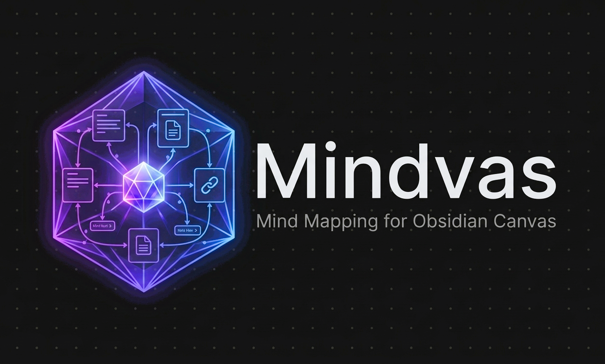

# Mindvas — Mind Mapping Plugin for Obsidian

**Turn Obsidian Canvas into a full-featured mind mapping tool — keyboard-driven editing, automatic tree layout, outline panel, branch coloring, and more.**

   

***

### 🧠 What is Mindvas?

Mindvas is an Obsidian plugin that transforms the built-in Canvas into a complete mind mapping tool. If you've used apps like XMind, FreeMind, or MindNode but wanted your mind maps to live inside your vault alongside your notes, Mindvas bridges that gap.

Canvas gives you a great visual foundation, but it doesn't know about trees. Mindvas adds the missing layer: tree-aware keyboard shortcuts, automatic node layout, an outline sidebar, branch colors, and everything else you'd expect from a dedicated mind mapping app — stored as standard Obsidian Canvas files.

### 🤔 Why Mindvas?

* **Lives in your vault** — mind maps are regular `.canvas` files alongside your notes, not a separate app
* **Keyboard-first** — add children, siblings, navigate, delete, and re-layout without touching the mouse
* **Contour-based auto-layout** — packs nodes tightly as the map grows, with left/right branch support
* **Outline panel** — sidebar with search, drag-and-drop, groups, and bidirectional highlight sync
* **Runs locally** — no network requests, no telemetry, no external services

### ✨ Features

* **Keyboard-driven editing** — Add, delete, and navigate nodes entirely from the keyboard
* **Auto-layout** — Contour-based tree layout packs nodes tightly with left/right branch support
* **Map outline** — Sidebar panel with groups, search, drag-and-drop, inline rename, and bidirectional highlight sync
* **Node referencing** — Copy clickable links to any node; paste in notes or other canvases for instant navigation
* **Insert between nodes** — Alt+click a connection point to insert a new node between parent and child
* **Forest layout** — Arrange multiple trees within a group into a clean grid
* **Branch coloring** — Each top-level branch gets a distinct color automatically
* **Subtree drag** — Dragging a node moves its entire subtree; hold `Alt` to move a single node
* **Auto-resize** — Nodes resize to fit their content as you type
* **FreeMind import** — Import `.mm` files directly into Canvas
* **Non-Latin keyboard support** — Physical key fallback for Arabic, Hebrew, Cyrillic, and other layouts

### 🚀 Quick Start

1. Install the plugin and open any Canvas
2. Click the brain icon in the canvas toolbar to enable mindmap mode
3. Create a text node — this is your root
4. Use the command palette (`Ctrl/Cmd+P`) to add child nodes, siblings, navigate, and more
5. Assign your own hotkeys in **Settings > Hotkeys** for faster workflow
6. The Map outline panel appears in the right sidebar for navigation

### 📦 Installation

#### Community Plugins

1. Open **Settings > Community plugins**
2. Search for **Mindvas**
3. Click **Install**, then **Enable**

Manual installation

1. Download `main.js`, `manifest.json`, and `styles.css` from the [latest release](https://github.com/mobench/mindvas/releases/latest)
2. Create a folder `mindvas` in your vault's `.obsidian/plugins/` directory
3. Copy the downloaded files into that folder
4. Enable the plugin in **Settings > Community plugins**

### ⌨️ Commands

All commands are available from the command palette (`Ctrl/Cmd+P`). Assign your own hotkeys in **Settings > Hotkeys**.

| Command                         | Description                                                       |
| ------------------------------- | ----------------------------------------------------------------- |
| Edit selected node              | Start editing the selected node                                   |
| Add child node                  | Create a new child node (selected text moves to child)            |
| Add sibling node                | Create a sibling node below the current one                       |
| Delete node and focus parent    | Remove the current node and select its parent                     |
| Flip branch to other side       | Move a branch to the opposite side of its parent                  |
| Toggle balanced layout          | Distribute children evenly on both sides, or collapse to one side |
| Navigate right/left/up/down     | Move selection spatially through the tree                         |
| Re-layout mind map              | Recalculate and apply layout to the entire canvas                 |
| Layout forest                   | Arrange trees within the selected group into a grid               |
| Detach subtree                  | Disconnect a branch into an independent tree                      |
| Resize & re-layout subtree      | Resize nodes in the subtree to fit content and re-layout          |
| Resize all nodes to fit content | Resize every node in the canvas to fit its content                |
| Apply branch colors             | Manually trigger branch color assignment                          |
| Toggle mindmap mode             | Enable or disable mindmap mode for the current canvas             |
| Import FreeMind file            | Import a `.mm` mind map file into the current canvas              |

### 🖱️ Mouse Actions

| Action                     | Result                                        |
| -------------------------- | --------------------------------------------- |
| Alt+click connection point | Insert a new node between parent and child    |
| Alt+click a node           | Select the entire tree                        |
| Ctrl+click a node          | Zoom to fit the branch                        |
| Right-click a node         | Copy node link (for cross-canvas referencing) |
| Right-click a group        | Layout forest, copy group link                |

Settings

| Setting                 | Description                                          | Default |
| ----------------------- | ---------------------------------------------------- | :-----: |
| Default mindmap mode    | Whether canvases open in mindmap mode by default     |    On   |
| Auto-layout             | Automatically arrange nodes after adding/deleting    |    On   |
| Auto-color branches     | Assign distinct colors to top-level branches         |    On   |
| Horizontal gap          | Space between parent and child nodes (px)            |    80   |
| Vertical gap            | Space between sibling nodes (px)                     |    20   |
| Default node width      | Width of newly created nodes (px)                    |   300   |
| Default node height     | Height of newly created nodes (px)                   |    60   |
| Max node height         | Maximum height before a node scrolls (px)            |   300   |
| Navigation zoom padding | Extra space around the target node when zooming (px) |   200   |

### 📖 Documentation

[**Find the documentation here.**](https://simbench.gitbook.io/mindvas/)

### 🤝 Contributing

Found a bug or have a feature request? [Open an issue](https://github.com/mobench/mindvas/issues).

### 💜 Support

If you find this plugin useful, you can support me [here](https://buymeacoffee.com/mobench) 😊.

### 📄 License

[MIT](LICENSE/)

***

> \[!NOTE] This plugin is desktop-only (Canvas is a desktop feature). It does not make network requests, collect telemetry, or access files outside your vault.
